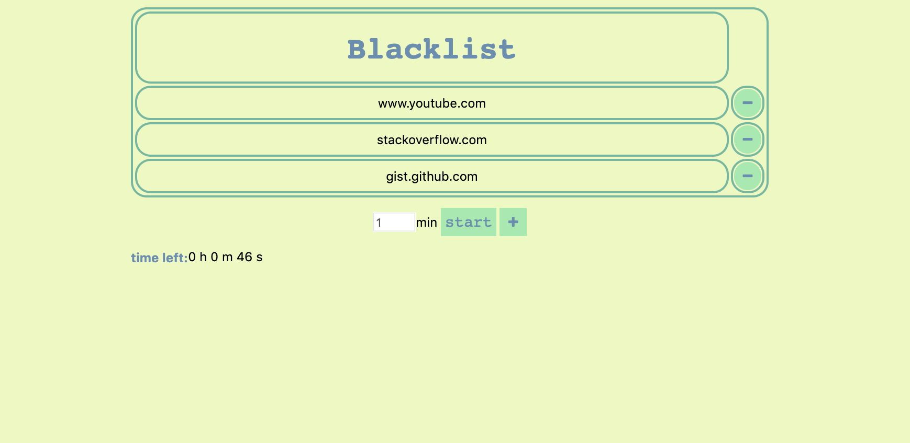
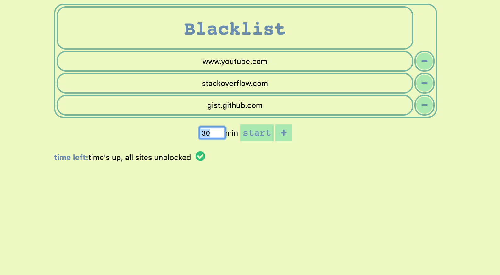

# Blacklist

---

## Short Description
A chrome extension designed to help users who would like to keep focused on their work. This extension can block the websites that users consider as distractions for a period of time set by users.

## Install
Download the directory, then go to chrome://extensions/ and click the Load unpacked extension, then select directory 'Blacklist'.

## Guid to use
- If user would like to add current webpage into blacklist, click 'add to blacklist' in context menu would block visit to all websites with current domain name.
- If user would like to see the whole blacklist, click 'see blacklist' in context menu. 
- User could also edit the blacklist by clicking 'add' or 'delete' button
- After setting up the blacklist, you can set the period of time you would like to block the websites on the blacklist
- When you start the timer, you would be blocked from visits to all sites on the blacklist till time's up. Once you visit the websites on the blacklist, there would be a popup alert showing up every 2 seconds reminding you that you are not allowed to visit the website now.

---

## Layout

---

